# Scam Town

**Survive payday.**

**Scam Town: walk through town on payday and survive the world's most common scams. Every trap teaches one rule that protects your money.**

A mobile game (installable PWA, fully offline, no account, no network calls) for anyone who gets paid, sends money home, sells things online or looks for work. It is global: pick USD, EUR, GBP, INR or NPR in Settings and every amount becomes **typical local pay and prices for that currency, never an exchange-rate conversion** (Sita's money from abroad is Rs. 30,000, Bikash's week of deliveries Rs. 7,000). Senders are generic ("your bank", "a delivery company", "a payment app"), and no real brands appear.

*Built by **Team Sol** for the Ullens Hack-a-thon (FinTech).*

| Title | Pick who you are | Scam Town | The call |
|---|---|---|---|
| 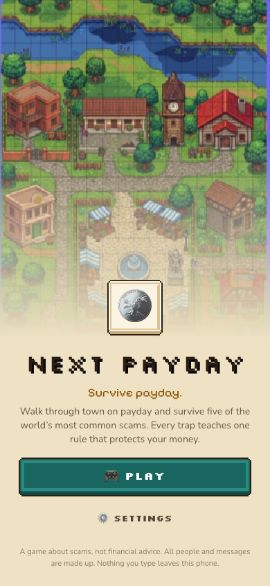 | 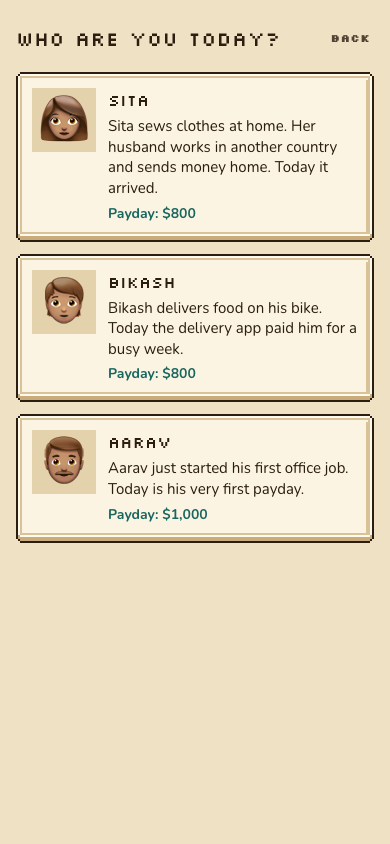 | 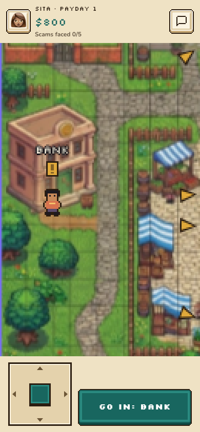 | 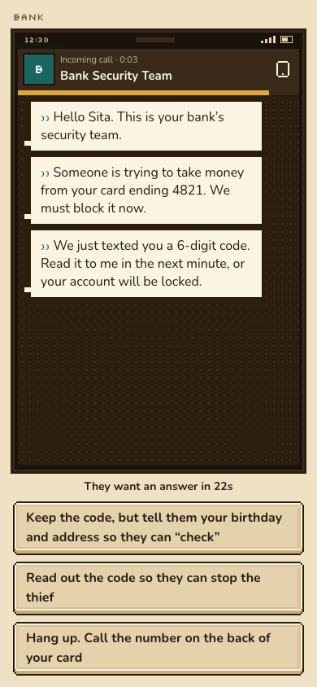 |

| What it cost | Who it really was | Rule card | Results |
|---|---|---|---|
| 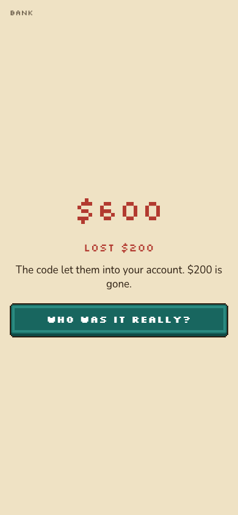 | 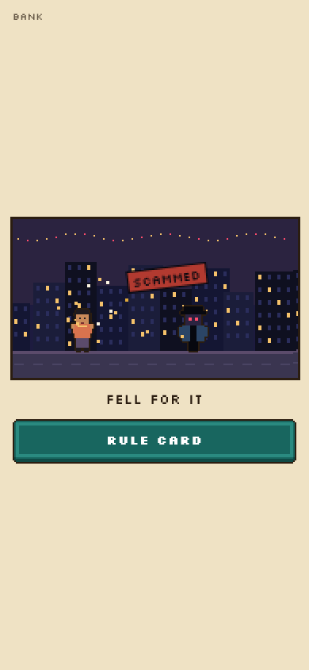 | 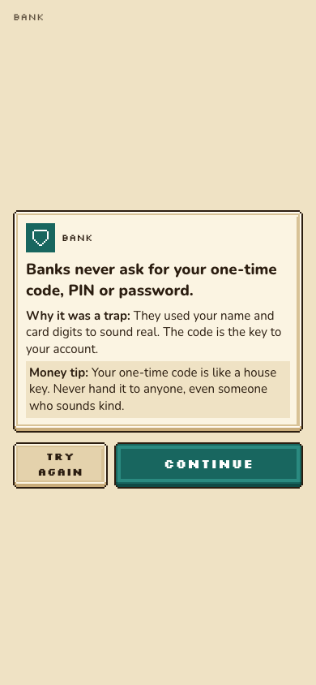 | 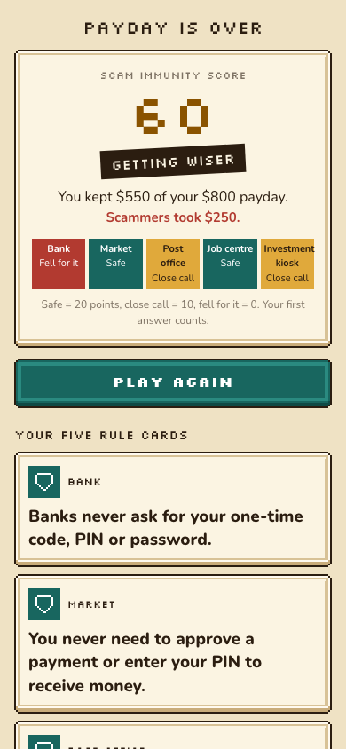 |

| Family Warning Card | Scam Checker | Main Street, south of the loop |
|---|---|---|
| 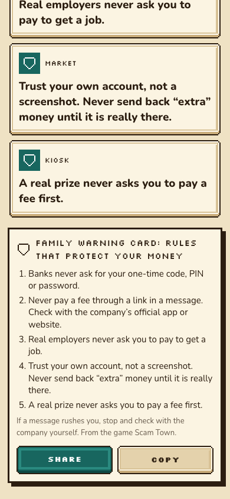 | 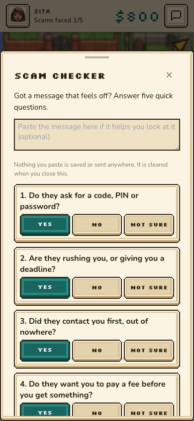 | 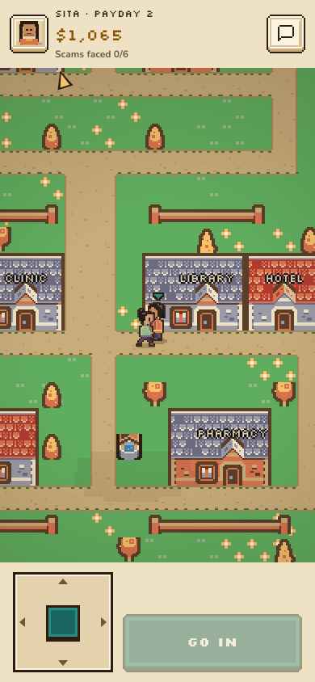 |

## Why we made it

Payday is when people have the most money in their account, and it is exactly when scammers strike: a "bank" call about a blocked account, a "buyer" asking you to approve a payment, a parcel fee, a job that costs money to start. Most money apps teach budgeting. We wanted a game where you *feel* the pressure of a scam, make the call yourself, see what it cost, and walk away with one rule you can pass on to your family.

## What our team did

- **The idea.** A global game about the scams that hit people on payday, where you feel the pressure of a scam before you learn the rule that beats it.
- **The scams and their rules.** We chose the five core traps (bank code call, "approve to receive" payment, parcel fee link, pay-to-work job, guaranteed returns), wrote the rule each one teaches, and asked for more everyday traps for later paydays. We insisted on real messages mixed in, so the lesson is *verify*, not *fear*.
- **The game design.** Payday as the moment of risk. Fall, close-call and safe choices with no villain shown until after you decide. The money changes first and the scammer is revealed second. "Try again" replays an encounter, a Scam Immunity Score with three tiers, a Family Warning Card to share, a Scam Checker on the phone, and a gauntlet loop of paydays.
- **Realistic money.** We called for typical local pay in every currency instead of converted amounts, so nobody is paid lakhs by accident.
- **The look.** The town map, the character-select mockup and the art direction (ink text, warm paper panels, teal actions, amber warnings, pixel world with readable text) are ours. We picked the Kenney packs and pixelarticons to fill the gaps.
- **The engine.** Soren and Rayan worked on the money engine with Claude Code. Its rules come from our spec: every loss is booked to ScamLoss, safe answers score 20, close calls 10 and falling for it 0, with three tiers.
- **Playtesting.** We played the builds and sent them back with changes: fences you cannot walk through, paths that lead somewhere, a bigger map, names you can change, realistic pay, a cleaner character select.
- **The pitch.** The one-line pitch above and the demo plan in [docs/DEMO.md](docs/DEMO.md).

## How we built it

We wrote the specs and briefs (now kept in `CLAUDE.md`), made the designs, and worked with **Claude Code** (Anthropic) as our AI pair-programmer: we described each feature, reviewed and playtested what came back, and asked for changes until it played the way we wanted. Claude Code wrote most of the implementation code and tests and the placeholder art; commits it worked on carry a `Co-Authored-By: Claude` trailer, and [docs/AI_USAGE.md](docs/AI_USAGE.md) lists who did what.

## How a game goes

**Title → pick who you are → walk through town → face the scams → results → next payday.**

**Real stakes, and not everything is a scam.**
- **Rent and food are due** at the end of every payday (shown in the HUD). Fall for one scam and you can still pay; fall for two and you are short. A clear "Rent paid! You made it." or "You're short for rent." screen comes before the results.
- **Each building is real or a scam**, decided by the seed every payday: the bank and post office are real about 80% of the time, the rest about half. Real ones move money normally (a refund at the bank, a cash sale at the market, a genuine parcel fee with a receipt, a paid trial shift). Scams pretending to be the bank or post office ring your phone while you walk. Every time you choose: **do what they ask, check first, or say no**. Saying no to a real one costs a little (a missed refund or a late fee), so the skill is spotting the difference.
- **Results** show a record of every decision (real or scam, what you did, money in, out or missed) and 2-3 personal tips from your actual mistakes, or praise when you did well.
- **Main Street's pharmacy, bakery and school** open any time for quick money choices (needs before wants, paying on time), and money tips join the rule cards and the Family Warning Card.
- **A budget helper** behind the calculator icon fills in your money, rent and food, lets you type your own numbers, and shows "Left over" or "Short by" with one suggestion: about half for needs, some for wants, some saved. A planning helper, not financial advice; nothing is saved.


1. **Pick a citizen.** A home tailor whose family's savings come from abroad, a gig delivery rider, or a first-time office worker. Each has a fixed story, job, pay and the scams that often target people like them, but **the name is yours**: tap the pencil and play as yourself (or "Y/N"). Every message uses that name and that life, and **each citizen meets their own everyday scams first**, the kind that really happen to people like them.
2. **Payday.** You start at home with your pay. The HUD shows only who you are, which payday it is, your balance, "Scams faced X/N" and your phone.
3. **One scam at a time, in a new order every run.** Only the current building shows a cue and an arrow, and you never know which comes first: the bank's phone rings, someone at the market shouts your name, the post office buzzes with a notification, a "You're hired!" letter appears at the job centre, or a waving stranger with a "$$" sparkle shows up at the kiosk. About two seconds after each rule card, the next cue pops up. **Tap the building and you walk there along the paths** (and straight in), or tap any spot, or use the stick or the arrow keys. Fences, trees, walls, roofs, stalls and water block you, and the garden gate is the way out. If the building is off screen, an arrow at the edge points the way. Buildings whose turn has not come stay closed. Each citizen's first payday is their own five scams, fifteen in all, each with a different rule:

| Place | Home tailor | Delivery rider | First office job |
|---|---|---|---|
| Bank (a call) | "Bank security" wants the one-time code | A "pre-approved" loan with a fee first | "Account details missing", fill them in through a link |
| Market | A customer's fake payment screenshot: "send back the extra" | A buyer's payment request: "approve to receive" | A cheap second-hand laptop: "send a token to hold it" |
| Post office (a text) | A parcel held for a small fee, paid through a link | "Rider account on hold", log in through a link | "Tax refund waiting", enter your card to get it |
| Job centre | Sewing from home, pay for the kit first | A job abroad, pay the agent into his own account | "Like videos" tasks, top up to unlock bigger ones |
| Kiosk | A lucky draw she never entered, pay for delivery | A savings club that pays when you bring friends | A crypto group that charges "tax" to withdraw |

The rules, in the same order. Tailor: banks never ask for your one-time code; trust your own account, not a screenshot; never pay a fee through a link; real employers never charge you to start; a real prize never asks for a fee. Rider: never pay a fee to get a loan; you never approve a payment to receive money; never log in through a link; check a job agency's licence and get a contract; earning by recruiting people is a pyramid scheme. Office worker: update bank details only in the bank's own app; never send a "token" for something you have not seen; a tax refund never needs your card; a job that asks you to top up is a scam; a fee to withdraw is a warning sign.

4. **The encounter.** A short thought, then the scam arrives on a realistic phone screen: a call, a text, a chat or a payment page (a request to approve, a fake "payment successful" screenshot, a card-and-PIN form), with a countdown and personal details. **No villain is shown yet.** Three choices in shuffled order: one falls for it, one is a close call, one is safe.
5. **The outcome.** Your balance changes on screen (losses are booked in the ledger as ScamLoss): coins fly out of your wallet, or a shield pops up if you were safe. *Then* the sender is revealed in a pixel scene: a shield and a VERIFY stamp if you were safe, a CLOSE CALL stamp if you got away, or SCAMMED as they run off with your coins.
6. **The rule card.** Why it was a trap, the rule, and one money tip. **Try again** replays the same encounter as practice so you can see what the other choices would have done; your first answer still counts.
7. **Two real messages** arrive on your phone along the way (your bank confirming your pay, a family member checking in). They are safe to act on: the lesson is *verify*, not *everything is a scam*.
8. **Results.** What you kept of your pay, your **Scam Immunity Score** for that payday (safe 20, close call 10, fell for it 0, scaled to 100; 80–100 "Scam-proof", 50–70 "Getting wiser", under 50 "Easy target"), every rule card you have collected (in the order you played), and a **Family Warning Card** with those rules and Share and Copy buttons.
9. **The gauntlet loop.** **Next payday** starts the next round: pay lands again, your money carries over, and every countdown is 15% faster (down to 60%). Payday 2 opens the south district, a loop road built from Kenney Tiny Town tiles, with six everyday traps (and, further south, Main Street: a bakery, clinic, library, hotel, school and pharmacy, just for show):

| Place | The trap | The rule |
|---|---|---|
| Home | A "family member" texts from a new number: phone broke, send money today, don't call | If "family" messages from a new number asking for money, call their old number first. |
| Café | A QR sticker on the table asks for your card number and PIN | Check where a QR code takes you before you pay, and never type your PIN into a web page. |
| Phone repair | "Security alert, call support, install our app, pay for the fix" | Real warnings never ask you to call a number or install an app to "fix" your phone. |
| Tax office | "You owe tax. Pay in gift cards today or a late penalty is added" | Government offices never ask for gift cards or crypto, and never threaten arrest on the phone. |
| Rental office | A cheap room, the owner is abroad, send the deposit to get the keys | Never pay a deposit before you have seen the place and met the owner in person. |
| Shop | Branded shoes 80% off, bank transfer only | If a deal looks too good and they only take bank transfer, it is a trap. |

   Payday 2 works the same way, shuffled again, with its own cues: a "New number" text, a "Scan to pay" QR sticker, a "Virus found!" pop-up, a "Final notice!" letter, a "Room for rent!" shout and an "80% OFF!" tag. From payday 3, a seeded mix of five from that citizen's own eleven comes up. A third real message, a parcel update with no link and no fee, arrives on payday 2.

**The phone's Scam Checker** is a guided checklist, not a keyword score: does it ask for a code or PIN, rush you, contact you first, want an upfront fee, promise guaranteed money? It always ends with "Verify through an official number or website" and says it can miss new scams. Anything you paste is never stored.

**Demo mode** (long-press the coin on the title, or Settings): one character, starting at the bank door with the scams in their listed order, so the first scam (the bank call) is a few seconds away. See [docs/DEMO.md](docs/DEMO.md).

## How it is built

- **Vite + React 18 + TypeScript (strict)**, Tailwind, Framer Motion, Zustand (UI state only), Vitest, vite-plugin-pwa, NumberFlow. No backend, no login, no network calls, no API keys.
- **The money is in an engine, not the UI.** `src/engine/scamTown.ts` books payday and every scam loss as balanced double-entry postings (Wallet, Income, ScamLoss), computes the Scam Immunity Score, and shuffles each payday's scam order and each scam's choices with a seeded random generator (never `Math.random`). Only the first answer per encounter counts, so practice replays never change your balance.
- **Content is data.** The twenty-one traps (each citizen's own five, plus the everyday six), their three choices, losses (as shares of the character's pay), rule cards and the three real messages are in `src/content/scamTown.ts`; local pay and prices per currency in `src/content/economy.ts`; characters in `src/content/characters.ts`; all text in `src/i18n/en.ts`.
- **The paths work.** `scripts/build-collision.py` reads the team's map into a 4-pixel walk grid (fences, trees, buildings, stalls and water blocked; roads, grass and the plaza open). `scripts/build-district.py` builds the south district from tiles with its own blocked tiles. The walker's whole foot box is checked, and they slide around posts and door frames toward gaps. An audit of every reachable spot found the bank roof and some tree tops walkable; they are now blocked by hand in the script. **Tap to walk** (`src/walk/path.ts`) finds a shortest path on the same grid with the same rule, then walks it in straight lines. The town is drawn at full screen resolution with the art at 2x, wide enough to see the streets around you, and the camera eases after the walker in screen-pixel steps. Townsfolk walk their rounds on real paths, cloud shadows drift over the map and birds fly over, just for show (`src/ui/pixel/ambient.ts`).
- **57 tests** (`npm test`): rent and food (one scam you survive, two you do not, in every currency), the real-and-scam mix and its odds, the record and tips,: the Scam Town ledger, rounds and score, practice replays, local pay (no rupee pay reaches a lakh), each citizen's own five scams with fifteen different rules, every message filling its placeholders in every currency, collision (fences block, the gate opens, roofs and tree tops are solid, every door reachable on foot), tap to walk (the real walker reaches all 11 doors without touching a wall), the shuffled order (fixed in demo mode), every sprite frame building cleanly, editable names, no brand or local names in the scam text, the Scam Checker (always says verify, stores nothing), and the currency helper.

## Tools, libraries and assets

**Tools we used**

| Tool | What for |
|---|---|
| Claude Code (Anthropic) | AI pair-programmer under our direction (see "How we built it") |
| Node.js 20, npm | Running, testing and building the app |
| Vite, React, TypeScript, Tailwind | The app itself (versions below) |
| Vitest | 57 automated tests |
| Python 3.13 + Pillow 12 | Our asset scripts: recolouring the vendor art (`scripts/unify-assets.py`), building the walk grid from the town map (`scripts/build-collision.py`), building the south district from tiles (`scripts/build-district.py`), the people sprites (`scripts/build-people.py`) |
| Headless Chromium | Scripted playtests and the screenshots in this README |
| Git, GitHub, GitHub Actions, GitHub Pages | Version control, CI (typecheck, tests, build) and the live site |

**Runtime libraries** (shipped in the app)

| Library | Version | License | Used for |
|---|---|---|---|
| react, react-dom | 18.3.1 | MIT | UI |
| zustand | 5.0.15 | MIT | UI state and saved games |
| framer-motion | 11.18.2 | MIT | Transitions and sheets |
| @number-flow/react | 0.5.14 | MIT | Animated balance |
| zzfx | 1.4.0 | MIT | Sound effects, generated in code |
| canvas-confetti | 1.9.4 | ISC | Celebration when you score Scam-proof |
| @fontsource/nunito | 5.3.0 | OFL-1.1 | Font package (see Fonts) |
| @fontsource/silkscreen | 5.3.0 | OFL-1.1 | Font package (see Fonts) |
| @fontsource/pixelify-sans | 5.3.0 | OFL-1.1 | Font package (see Fonts) |
| pixelarticons | 2.4.1 | MIT | Pixel UI icons (only the 40 we use are bundled) |

**Development tools** (not shipped)

| Tool | Version | License |
|---|---|---|
| vite | 5.4.21 | MIT |
| vite-plugin-pwa | 0.20.5 | MIT |
| @vitejs/plugin-react | 4.7.0 | MIT |
| typescript | 5.6.3 | Apache-2.0 |
| vitest | 2.1.9 | MIT |
| tailwindcss | 3.4.19 | MIT |
| postcss | 8.5.28 | MIT |
| autoprefixer | 10.6.1 | MIT |
| @types/react, @types/react-dom, @types/node, @types/canvas-confetti | various | MIT |

**Fonts.** All are bundled through @fontsource and work offline. None are loaded from the internet.

| Font | License | Used for |
|---|---|---|
| Nunito | SIL Open Font License 1.1 | Body text, money, dates |
| Silkscreen | SIL Open Font License 1.1 | Pixel headings and buttons |
| Pixelify Sans | SIL Open Font License 1.1 | Pixel accents |

**Pre-made asset packs.** Originals and their licence files are in `vendor/`. `scripts/unify-assets.py` recolours them into the game's single palette (`src/ui/palette.ts`) and adds the same ink outline as the rest of the art.

| Pack | Author | Licence | What we use |
|---|---|---|---|
| [Pixel UI Pack](https://kenney.nl/assets/pixel-ui-pack) | Kenney | CC0 1.0 | Nine-slice panels and buttons, recoloured |
| [Tiny Town](https://kenney.nl/assets/tiny-town) | Kenney | CC0 1.0 | 16×16 town tiles, recoloured. Weapon, tool and explosive tiles were left out (list in `vendor/README.md`) |
| [pixelarticons](https://github.com/halfmage/pixelarticons) | Gerrit Halfmann | MIT | UI icons |

CC0 needs no credit, but we credit Kenney anyway. We used no other stock images or third-party sprites.

**Our own art.**

| Asset | Made by | Where |
|---|---|---|
| Town map | Our team, during the event | `public/sprites/town-map.png`, `design/town-map-concept.png` |
| UI/UX screen designs, including the character select | Our team, during the event | `design/`, `docs/UI_NOTES.md` |
| Walking people (the player and the townsfolk) | Pixel templates drawn in `scripts/build-people.py`, made with Claude Code to our art direction (shaded to match the map) | `scripts/build-people.py`, `src/ui/pixel/people.ts` |
| Character portraits, scammers and world props | Code-drawn placeholders (`placeholder_*`), made with Claude Code to our art direction; to be replaced by team sprites | `src/ui/pixel/`, list in `docs/SPRITES_NEEDED.md` |
| App icon (coin, S and shield) | Drawn in SVG with Claude Code | `public/icon.svg` and PNG exports |
| Sound effects | Generated in code with ZzFX | `src/audio/sfx.ts` |
| Emoji | The device's own system emoji, not bundled | — |

## Run locally

```bash
npm install
npm run dev        # http://localhost:5173
npm test           # Vitest tests
npm run typecheck
npm run build && npm run preview
```

Long-press the coin on the title screen for **demo mode**: one character, straight to the bank door. The live site at https://sorenhgautam-dev.github.io/team-sol-ullens-hackathon/ is built from `main`, which does not have this branch yet.

## Honest notes

- All people, messages, phone numbers and links in the game are made up. Links use the reserved `.example` domain.
- Pay and prices are typical local figures chosen for the game, not data. Nothing in the scam game is converted between currencies.
- The game teaches twenty-one common patterns, chosen because they really happen, not because they are dramatic. Real scams change; the Scam Checker says so and always points to verifying through an official number or website.
- It is a game about scams, not financial advice. Nothing you type leaves the phone.
