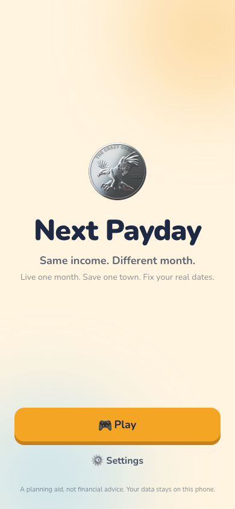
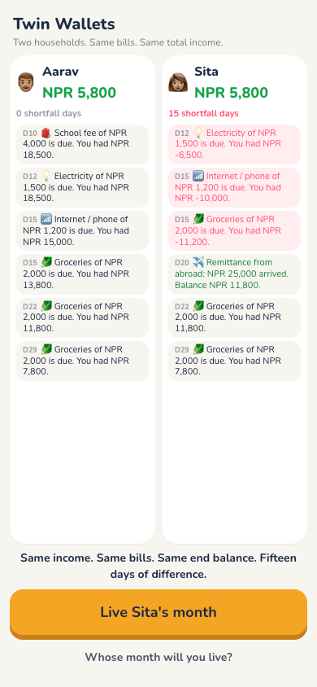
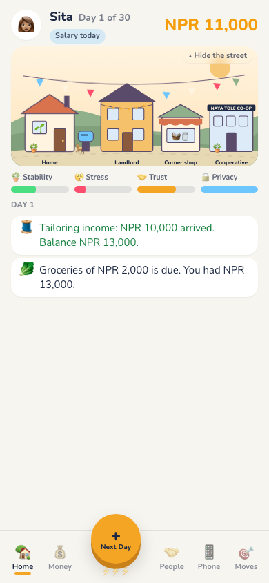
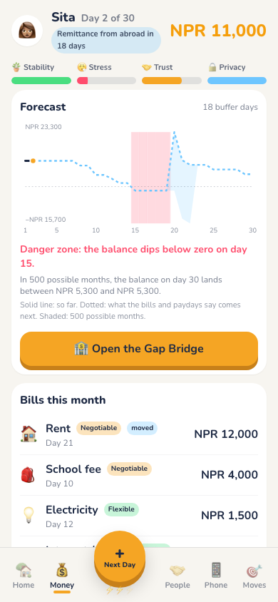
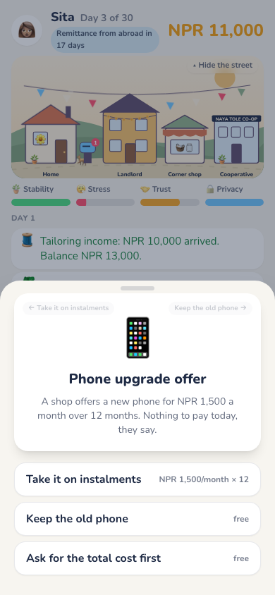
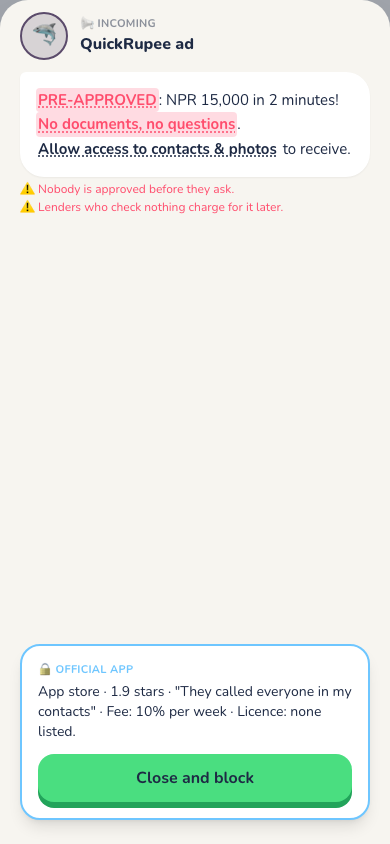
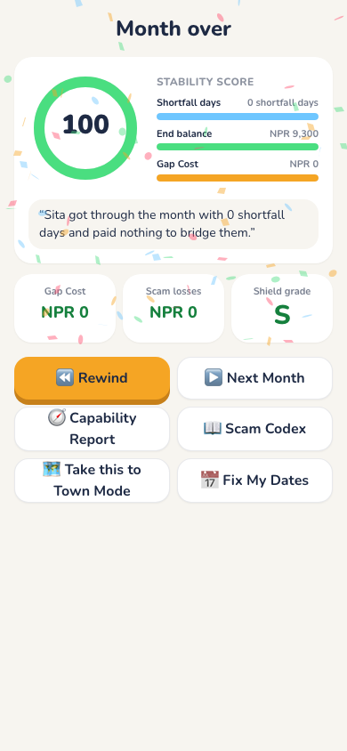
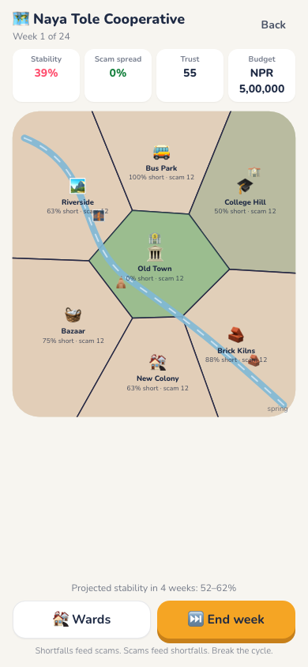

# Next Payday

**Same income. Different month.**  
*Live one month. Save one town. Fix your real dates.*

A mobile game (installable PWA, fully offline) about a problem most money apps ignore: **when** money arrives matters as much as **how much**. Two households with the same income and the same bills end the month with the same balance, but one of them spends fifteen days below zero, and that is exactly when the scammers call.

> *The same engine that runs one household runs the whole town.*

**Play it:** https://sorenhgautam-dev.github.io/team-sol-ullens-hackathon/ (open on a phone → "Install the app")

| Title | Twin Wallets | Life Mode | Forecast |
|---|---|---|---|
|  |  |  |  |

| Event card | Scam encounter | Month over | Town Mode |
|---|---|---|---|
|  |  |  |  |

## The three things the game teaches

1. **When money arrives matters as much as how much arrives.** Sita and Aarav both earn NPR 35,000 and pay NPR 28,700 in bills. Aarav is paid on day 1. Sita gets NPR 10,000 on day 1 and a NPR 25,000 remittance on day 20. Same end balance; Sita is below zero for 15 days.
2. **Every way of bridging a gap has a cost. Find the full cost before choosing.** The Gap Bridge shows the money cost, the future obligation and the hidden cost of each option, from "ask family" (NPR 0, one heart) to an instant loan app (NPR 1,170, your contacts, and a repayment that lands two days *before* the remittance).
3. **Urgency is a reason to verify, not a reason to act faster.** Eight original scammers message when the player is most stretched. Verifying, waiting and blocking are always free. Two real messages are mixed in, so suspicion of everything is not the lesson; calm verification is.

## What you can do in the game

- **Life Mode** (the centrepiece): a tap-to-advance life sim. Home Street hub, Life Log, stat bars (Stability, Stress, Trust, Privacy), five tabs, event cards with swipe, timing levers (move or split rent, autopay day, pay early), Gap Bridge, energy, friendship hearts, mailbox, Savings Sprout, goodnight screen, month calendar.
- **The Scam Squad**: the Phisher, the Loan Shark App, the Impersonator, the OTP Snatcher, the Fine Print, the Prize Ghost, the Job Recruiter, the Investment Guru, plus two decoys. Tap the tells, open the mock "official app" to see the truth, earn Shield points, collect the Codex. Leak your data once and the next scam knows your name, your husband's name and your remittance date.
- **End of month**: Stability Score with breakdown, Gap Cost, Shield grade, a one-line life summary, **Month Rewind** (change one past decision, everything else replays, impossible ones are marked Blocked), **What-If cards** ("Moving rent to day 21 would have removed 10 shortfall days", labelled *Your choice* or *Not your fault*), and a **Capability Report** built from behaviour, not quiz answers.
- **Fix My Dates** (real life): enter your pay dates and bills; a Shift Finder tries every legal date change over 60 days in a Web Worker (about 80 ms), never moves fixed bills, and ranks by fewest shortfall days. The **Ask Builder** writes the polite request to your landlord, school, employer or provider. Copy, share, and "They said no" re-ranks.
- **Town Mode**: run the Naya Tole Cooperative. Seven wards on a Voronoi map, each a household archetype run through the same engine. Shortfalls feed scams and scams feed shortfalls; scams spread to neighbouring wards. Eight initiatives with costs, deploy times and trade-offs, seeded weekly events, a 4-week Monte Carlo outlook, win/lose and a grade. Sita's house is highlighted in Riverside: *"Sita is one of 60 households in Riverside facing the same gap."*
- **Impact Lab** (Settings): a 3-question check before and after a month, stored locally, with a copyable summary for testers.

## How it is built

- **Vite + React 18 + TypeScript (strict)**, Tailwind, Framer Motion, Zustand (UI state only), Vitest, vite-plugin-pwa, NumberFlow, use-gesture, d3-delaunay, ZzFX, canvas-confetti. No backend, no login, no network calls.
- **One pure engine**: `simulate(scenario, profile, decisions, seed) → Ledger` in `src/engine/simulate.ts`. Deterministic (mulberry32, never `Math.random`). Daily order: income → bills → events and scams → player decisions. The forecast is a dry run of the same engine; Monte Carlo is 500 dry runs with varied seeds in a Web Worker; Rewind, What-If, the Capability Report, the Shift Finder and the Town engine all call it. **The UI never calculates money.**
- **Content is data** (`src/content/`): bills, profiles, events, scammers, bridges, initiatives, wards. New content needs no engine code.
- **Every player action is logged** as a typed `PlayerAction`, which is what makes Rewind and the Capability Report possible.
- **84 tests** (`npm test`) including the exact numbers below, determinism, forecast = actual, scam losses, privacy leak personalisation, hearts rules, energy rules, Shift Finder guarantees, town determinism and spread adjacency.

| Situation | Shortfall days | Lowest balance | End balance |
|---|---|---|---|
| Aarav, no events | 0 | 9,300 | 9,300 |
| Sita, no events | 15 (days 5–19) | −11,700 | 9,300 |
| Sita, rent moved to day 21 | 0 | 300 | 9,300 |
| Sita + bike repair 3,500 on day 9, rent moved | 5 | −3,200 | 5,800 |
| Sita + repair, rent and school fee moved to day 21 | 0 | 800 | 5,800 |

## Tools, libraries and assets

**AI coding assistant.** We used **Claude Code** (Anthropic) to write code, tests, animation and effect code, placeholder art and documentation drafts. Every commit it helped with carries a `Co-Authored-By: Claude` trailer. See [docs/AI_USAGE.md](docs/AI_USAGE.md) for who did what.

**Runtime libraries** (shipped in the app)

| Library | Version | License | Used for |
|---|---|---|---|
| react, react-dom | 18.3.1 | MIT | UI |
| zustand | 5.0.15 | MIT | UI state and saved games |
| framer-motion | 11.18.2 | MIT | Transitions and sheets |
| @number-flow/react | 0.5.14 | MIT | Animated balance |
| @use-gesture/react | 10.3.1 | MIT | Swipeable event cards |
| d3-delaunay | 6.0.4 | ISC | Town Mode ward geometry |
| zzfx | 1.4.0 | MIT | Sound effects, generated in code |
| canvas-confetti | 1.9.4 | ISC | Celebration effect |
| @fontsource/nunito | 5.3.0 | OFL-1.1 | Font package (see Fonts) |
| @fontsource/silkscreen | 5.3.0 | OFL-1.1 | Font package (see Fonts) |
| @fontsource/pixelify-sans | 5.3.0 | OFL-1.1 | Font package (see Fonts) |

**Development tools** (not shipped)

| Tool | Version | License |
|---|---|---|
| vite | 5.4.21 | MIT |
| vite-plugin-pwa | 0.20.5 | MIT |
| @vitejs/plugin-react | 4.7.0 | MIT |
| typescript | 5.6.3 | Apache-2.0 |
| vitest | 2.1.9 | MIT |
| tailwindcss | 3.4.19 | MIT |
| postcss | 8.5.28 | MIT |
| autoprefixer | 10.6.1 | MIT |
| @types/react, @types/react-dom, @types/node, @types/canvas-confetti, @types/d3-delaunay | various | MIT |

**Fonts.** All are bundled through @fontsource and work offline. None are loaded from the internet.

| Font | License | Used for |
|---|---|---|
| Nunito | SIL Open Font License 1.1 | Body text, money, dates |
| Silkscreen | SIL Open Font License 1.1 | Pixel headings and buttons |
| Pixelify Sans | SIL Open Font License 1.1 | Pixel accents |

**Art and assets.** We used no pre-made art packs, stock images or third-party sprites.

| Asset | Made by | Where |
|---|---|---|
| Town map | Our team, during the event | `public/sprites/town-map.png`, `design/town-map-concept.png` |
| UI/UX screen designs | Our team, during the event | `design/`, `docs/UI_NOTES.md` |
| Sita, the courier, scammers, buildings and effects | Code-drawn placeholders (`placeholder_*`) by Claude Code, to be replaced by team sprites | `src/ui/pixel/`, list in `docs/SPRITES_NEEDED.md` |
| App icons | Drawn in SVG by Claude Code | `public/icon.svg` and PNG exports |
| Sound effects | Generated in code with ZzFX | `src/audio/sfx.ts` |
| Emoji | The device's own system emoji, not bundled | — |

## Run locally

```bash
npm install
npm run dev        # http://localhost:5173
npm test           # Vitest engine tests
npm run typecheck
npm run build && npm run preview
```

Long-press the coin on the title screen for **demo mode** (fixed seeds, faster animations, a visible scam outbreak in Town Mode).

## Honest notes

- Rates in the Gap Bridge are illustrative and marked as such in the app.
- Town Mode balance is a first pass: the town starts around 40% stability and needs several initiatives to reach the 80% win line.
- It is a planning aid, not financial advice. Your data stays on the phone.
